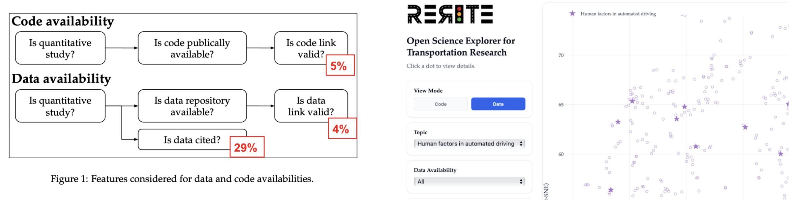
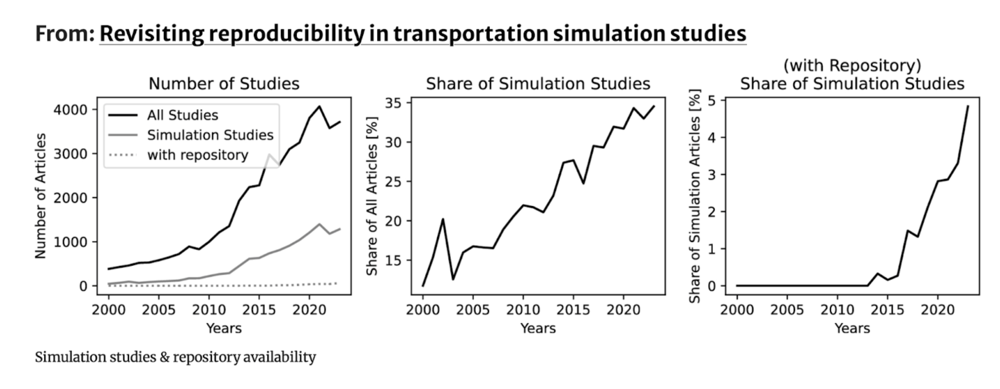
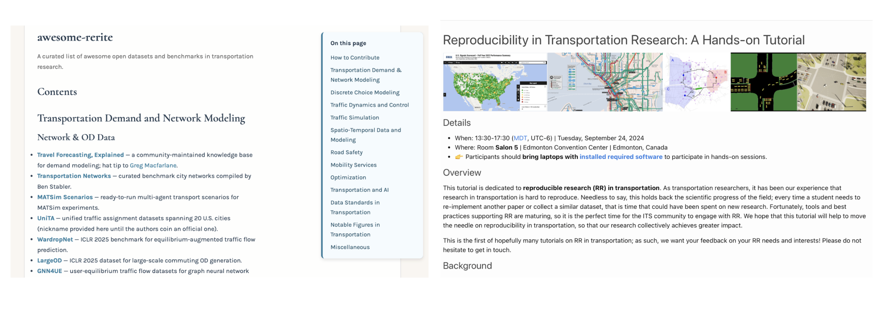

::: {.newsletter-content}

{width=50% fig-align="center"}

Dear RERITERs,
Welcome to the first newsletter of the Reproducible Research in Transportation working group (RERITE). We’ll use this space to share brief updates, highlight opportunities to collaborate, and recognize the contributions that move our work forward. The goal is to keep it lightweight, useful, and easy to scan.

## What we’ve been working on

- [Measuring Open Science in Transportation (MOST)](https://www.rerite.org/MOST) - Our new [study](https://doi.org/10.48550/arXiv.2601.14429) utilizes Large Language Models (LLMs) to measure the adoption of open science practices across thousands of transportation research papers. A [platform](https://www.rerite.org/MOST/explorer.html) allows readers and reviewers to explore our findings and verify the data and code availability state in the field.

{width=100% fig-align="center"}

- [Topical collection on Reproducible Research in Transportation](https://link.springer.com/collections/dgachijbgi) - This collection in European Transport Research Review aims to highlight the importance of reproducibility in transportation research, fostering advancements and enhancing the credibility of scientific findings. One study is already published, while others have been accepted recently or are still under review.

{width=100% fig-align="center"}

## What’s coming up

- [IEEE IV Symposium 2026 Workshop](https://www.rerite.org/ivs-2026) (June 22, 2026) – Half-day session focused on open datasets, benchmarks, and testbeds in intelligent vehicle research.

## Ways to get involved

### Call for nominations: Your papers for reproducibility student projects

As part of our initiative to promote transparency and reproducibility in transportation research, we are offering a series of Master’s projects focused on reproducing influential papers. If you would like to nominate one of your papers for reproducibility, please fill out this [Google form](https://forms.gle/Yv2i3EoPYoBoPDhr8). 

### Call for volunteers
We’re looking for volunteers to support several initiatives across communications, data, and open science. If you are interested in any of the roles listed below, please fill out this [Google form](https://docs.google.com/forms/d/e/1FAIpQLSeCnzBI1E76eOK-p_UTNsJrtcbflaLrngPwqyGkoD_Jd-T23g/viewform?usp=header).

**Communication & Content**

* **Digital Content Manager** – Familiarity with graphic design and copywriting to assist with social media calendars and newsletter drafts. 
* **Newsletter Manager** – Familiarity with Google Docs and preferably with HTML to support newsletter preparation (≈2–4 h/month). 
* **Community Moderator -  Discord** – Familiarity with Discord and interest in community building to help grow and moderate our Discord community.

**Data & Research Support**

* **Data & ML Specialists – Benchmark Datasets** – Familiarity with Python, data cleaning, and ML basics to help curate and standardize benchmark datasets for the repository.
* **Data & ML Specialists – Scientific Study** – Familiarity with Python and data analysis to contribute to the next study on measuring reproducibility. 

**Open Science & Resources**

* **Open Resources Curator** – Familiarity with basic web development to improve and maintain the explorer of available datasets and codebases.
* **Open Science Audit Team – Journal Expansion** – Familiarity with LLMs, Python, and stats to expand open science audit to more journals. 
* **Open Science Audit Team – Feature Expansion** – Familiarity with LLMs, Python, and stats to expand audit to additional transparency and reproducibility features. 
* **Reproducibility Tutorial Fellow** – Familiarity with Git and basic reproducibility workflows to review and improve existing tutorial materials.

## Shout-outs & thanks

- Thanks to Junyi Ji for volunteering to design and set up the RERITE website. Your work makes our resources accessible to everyone and greatly contributes to our communication efforts.
- Thanks to all friends and members who reviewed articles for the topical collection in European Transport Research Review. Your feedback was invaluable in improving the studies and supporting reproducible research in transportation.

## Resources & links

- [Awesome-RERITE](https://www.rerite.org/awesome-rerite): a list of open datasets and tools in transportation research
- [Data explorer](https://www.rerite.org/MOST/explorer): a dashboard to explore papers with available data or code.
- [Hands-on Tutorial](https://www.rerite.org/itsc24-rr-tutorial/): step-by-step guidance on reproducible workflows in transportation research. 

{width=100% fig-align="center"}
---

**Questions or ideas?**

Contact us: Silvia Varotto (silviafrancesca.varotto@entpe.fr), Communication officer

Join our [mailing list](https://groups.google.com/g/rerite/) and [LinkedIn group](https://www.linkedin.com/groups/10084451).
:::
